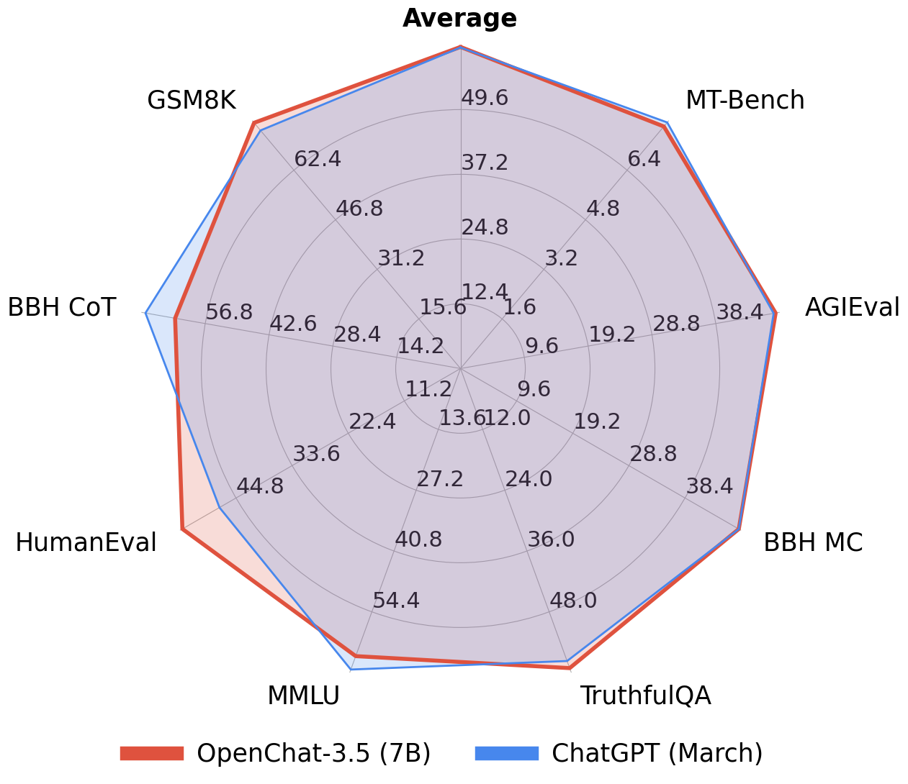
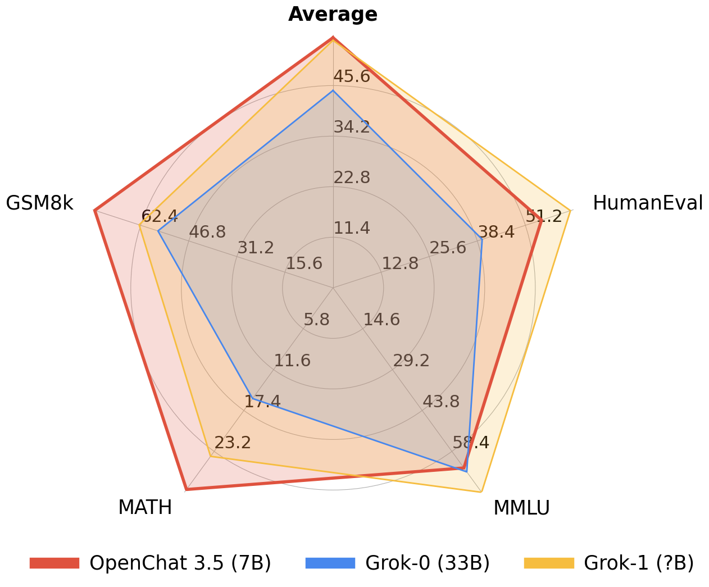

# OpenChat: Advancing Open-source Language Models with Mixed-Quality Data

<div align="center">
  
</div>

<p align="center">
  <a href="https://openchat.team">Online Demo</a> •
  <a href="https://discord.gg/pQjnXvNKHY">Discord</a> •
  <a href="https://huggingface.co/openchat">Huggingface</a> •
  <a href="https://arxiv.org/pdf/2309.11235.pdf">Paper</a>
</p>

**🔥 The first 7B model that Achieves Comparable Results with ChatGPT (March)! 🔥**

**🤖 #1 Open-source model on MT-bench scoring 7.81, outperforming 70B models 🤖**

<div style="display: flex; justify-content: center; align-items: center">
  
  
</div>

OpenChat is an innovative library of open-source language models, originally fine-tuned with [C-RLFT](https://arxiv.org/pdf/2309.11235.pdf) - a strategy inspired by offline reinforcement learning. The current codebase supports SFT, DPO, ORPO, and KTO training with padding-free training and the Multipack Sampler, achieving 3–10× speedup over conventional padded training. DPO and ORPO use a combined forward approach (single forward for both chosen and rejected) compatible with DeepSpeed's forward/backward pairing; KTO uses unpaired data with a single forward pass.

[](https://zenodo.org/badge/latestdoi/645397533)

## <a id="models"></a> Models

Our latest model, OpenChat 3.5, is a highly capable model fine-tuned using C-RLFT with Mistral 7B as the base, on a collection of publicly available high-quality instruction data. For older version models such as OpenChat 3.2 SUPER, please refer to [Legacy Models](#legacy-models).

For inference with Huggingface Transformers, follow the conversation template provided below.

<details>
  <summary>Conversation templates (click to expand)</summary>

```python
import transformers
tokenizer = transformers.AutoTokenizer.from_pretrained("openchat/openchat_3.5")

# Single-turn
tokens = tokenizer("GPT4 Correct User: Hello<|end_of_turn|>GPT4 Correct Assistant:").input_ids
assert tokens == [1, 420, 6316, 28781, 3198, 3123, 1247, 28747, 22557, 32000, 420, 6316, 28781, 3198, 3123, 21631, 28747]

# Multi-turn
tokens = tokenizer("GPT4 Correct User: Hello<|end_of_turn|>GPT4 Correct Assistant: Hi<|end_of_turn|>GPT4 Correct User: How are you today?<|end_of_turn|>GPT4 Correct Assistant:").input_ids
assert tokens == [1, 420, 6316, 28781, 3198, 3123, 1247, 28747, 22557, 32000, 420, 6316, 28781, 3198, 3123, 21631, 28747, 15359, 32000, 420, 6316, 28781, 3198, 3123, 1247, 28747, 1602, 460, 368, 3154, 28804, 32000, 420, 6316, 28781, 3198, 3123, 21631, 28747]

# Coding Mode
tokens = tokenizer("Code User: Implement quicksort using C++<|end_of_turn|>Code Assistant:").input_ids
assert tokens == [1, 7596, 1247, 28747, 26256, 2936, 7653, 1413, 334, 1680, 32000, 7596, 21631, 28747]
```

</details>

## <a id="installation"></a> Installation

First, make sure your nvidia driver version is at least 580. Check it by

```bash
cat /proc/driver/nvidia/version
```

If the version less than 580, you could reinstalled it by

```bash
sudo apt purge "^nvidia*"
sudo apt purge "^libnvidia*"
sudo apt autoremove
sudo apt install nvidia-driver-580
# reboot after this
```

Second, make sure cuda that you use in your environment is CUDA 13.0. You could install cuda by

```bash
sudo apt install cuda-toolkit-13-0
```

If CUDA 13.0 not exist in your package manager, add it first

```bash
wget https://developer.download.nvidia.com/compute/cuda/repos/<distro>/<arch>/cuda-keyring_1.1-1_all.deb # example distro=ubuntu2204, arch=x86_64
sudo dpkg -i cuda-keyring_1.1-1_all.deb
sudo apt-get update
```

Then, after make sure CUDA 13.0 already installed in `/usr/local/cuda-13.0`, add it to your path and ld library path in `~/.bashrc` or `~/.profile`

```bash
export PATH=/usr/local/cuda-13.0/bin:$PATH
export LD_LIBRARY_PATH=/usr/local/cuda-13.0/lib64${LD_LIBRARY_PATH:+:${LD_LIBRARY_PATH}}
```

Then, log out your terminal session and re-log in. Check CUDA version by

```bash
nvcc --version
```

To use OpenChat, you need to install PyTorch. If you encounter compatibility problems, you can try to create a new `conda` environment following the instructions below.

```bash
conda create -y --name openchat
conda activate openchat

conda install -y python=3.11
pip3 install torch==2.11.0 torchvision --index-url https://download.pytorch.org/whl/cu130

pip3 install git+https://github.com/fahadh4ilyas/openchat.git@finetune
```

<details>
  <summary>In addition to PyPI, you can also install from source (click to expand)</summary>

```bash
git clone https://github.com/fahadh4ilyas/openchat.git
cd openchat
git switch finetune

pip3 install --upgrade pip  # enable PEP 660 support
pip3 install -e .
```
</details>

## <a id="training"></a> OpenChat Model Training

The OpenChat training system utilizes padding-free training and the [Multipack Sampler](https://github.com/imoneoi/multipack_sampler), achieving a **3~10x** speedup compared to the conventional padded training.

### Code Organization

```
ochat/
├── config/              # Model configs, conversation templates
├── models/              # Unpadded model implementations
├── training_utils/      # Shared training infrastructure
│   ├── _training_args.py       # BaseTrainingArguments, LoraTrainingArgsMixin
│   ├── _common.py              # Shared: batch collation, LR, checkpointing, MLflow
│   ├── _ce_utils.py            # Shared: weighted CE, token accuracy, LM loss
│   ├── base_train.py           # Shared: model creation, eval loop, ref log-prob caching
│   ├── numpy_dataset.py        # NumpyDataset (shared by SFT/DPO/ORPO/KTO)
│   ├── multipack_dataloader.py # Base distributed dataloader
│   ├── multipack_dataloader_ring.py  # Base ring-attention dataloader
│   ├── multipack_dataloader_ring_dpo.py  # DPO/ORPO ring dataloader (chosen_/rejected_ keys)
│   └── multipack_dataloader_single.py   # Single-GPU dataloader
├── training_sft/        # SFT training (train, train_ring, train_single)
├── training_dpo/        # DPO training (train, train_ring, train_single, utils)
├── training_orpo/       # ORPO training (train, train_ring, train_single, utils)
├── training_kto/        # KTO training (train, train_ring, train_single, utils)
├── data/                # Dataset preprocessing (tokenize → Arrow/Parquet)
├── kernel/              # Custom CUDA kernels
├── deepspeed_config/    # DeepSpeed ZERO stage JSON configs
├── scripts/             # Utility scripts
└── tests/               # pytest tests (CPU markers)
```

### Supported Model Families

OpenChat supports a wide range of base model architectures. Each family has variants for long context (`Long`), ring attention (`Ring`), tensor-parallel split (`Split`), mixture-of-experts (`Moe`), and ChatML / DeepSeek / Instruct conversation templates.

| Family | Model Types (partial) | Conversation Templates |
|---|---|---|
| **Llama** | `llama`, `llama3`, `llama3.1` | V3.2 (`<\|end_of_turn\|>`), ChatML |
| **Mistral** | `mistral`, `mixtral` (MoE) | V3.2, ChatML |
| **Qwen 2** | `qwen2` | V3.2, ChatML, DeepSeek |
| **Qwen 3** | `qwen3`, `qwen3Moe` | V3.2, ChatML, DeepSeek |
| **Qwen 3.5** | `qwen3_5`, `qwen3_5Moe` | ChatML |
| **Gemma** | `gemma`, `gemma2` | V3.2, ChatML, Instruct |
| **Phi** | `phi`, `phi_ori` | V3.2, ChatML |
| **DeepSeek V2** | `deepseekv2` | DeepSeek |
| **Zephyr** | `zephyr` | Zephyr |

> Append `_chatml` (e.g. `mistral_chatml`) for ChatML-format models. Append `Ring` for ring-attention variants (e.g. `llamaRing`). The full registry is in `ochat/config/__init__.py`.

## Choose a base model

OpenChat supports Llama 2 and Mistral models. Please first choose a base model to fit your needs. Each base model has a corresponding weight repo, model type, and recommended batch size as listed below, they should be filled into `BASE_REPO`, `MODEL_TYPE`, and `BATCH_SIZE` in the following instructions.

| Base Model | Size | Weights (with EOT token)          | Model Type              | Recommended Batch Size per GPU (8xA100 80GB) |
|------------|------|-----------------------------------|-------------------------|--------------------------------------|
| Mistral    | 7B   | `imone/Mistral_7B_with_EOT_token` | `mistral` | 83968                                |
| Llama 2    | 7B   | `imone/LLaMA2_7B_with_EOT_token`  | `llama`         | 83968                                |
| Llama 2    | 13B  | `imone/Llama2_13B_with_EOT_token` | `llama`         | 36864                                |

Note: The OpenChat conversation template requires an `<|end_of_turn|>` special token. The base model specified must include this token. Our provided weights are the original base weights with this token added. If you want to add them manually, use the `convert_llama_weights_to_hf_add_tokens.py` or `mistral_add_tokens.py` in the `scripts` directory.

## Installing DeepSpeed, Flash Attention, Flash Linear Attention, and Causal Conv1d

First, ensure that the CUDA `nvcc` compiler is available in your environment. If it is not, install the CUDA toolkit that matches the version used by PyTorch.

Next, install DeepSpeed, Flash Attention, Flash Linear Attention, and Causal Conv1d by running the following commands:

```bash
pip install deepspeed flash-attn==2.8.3 flash-linear-attention==0.5.0 causal-conv1d==1.6.1 --no-build-isolation
```

> Better to set environment variable `DS_BUILD_CPU_ADAM=1` before installing deepspeed to build the optimizer.

Additionally, install ring flash attention:

```bash
pip install ring_flash_attn@git+https://github.com/zhuzilin/ring-flash-attention
```


### Preparing Your Data

To utilize the OpenChat trainer, prepare your SFT data into a JSON Lines format where each line corresponds to a `Conversation` object:

```python
class Message(BaseModel):
    role: str     # Must be "user" or "assistant"
    content: str  # Message content
    weight: Optional[float] = None  # Loss weight for this message. Typically 0 for user and 1 for assistant to supervise assistant's responses only
    name: Optional[str] = None # Additional name for the role


class Conversation(BaseModel):
    items: List[Message]  # All messages within the conversation
    condition: str = ""  # C-RLFT condition, can be any string or empty.
    system: str = ""  # System message for this conversation
    label: bool = True  # KTO label: True = desirable, False = undesirable

    images: Optional[List[str]] = None # Path to images relative to dataset directory
    videos: Optional[List[str]] = None # Path to videos relative to dataset directory
```

For basic SFT, assign `weight` as `0` for human messages and `1` for assistant responses.

SFT example:

```json
{"items":[{"role":"user","content":"Hello","weight":0.0},{"role":"assistant","content":"Hi","weight":1.0},{"role":"user","content":"How are you today?","weight":0.0},{"role":"assistant","content":"I'm fine.","weight":1.0}],"system":""}
{"items":[{"role":"user","content":"Who are you?","weight":0.0},{"role":"assistant","content":"I'm OpenChat.","weight":1.0}],"system":"You are a helpful assistant named OpenChat."}
```

For C-RLFT, `condition` should be set as the class the conversation belongs to (e.g. `GPT3` or `GPT4`). The `weight` is assigned as `0` for human messages and `w` for assistant responses, where `w` is the weight of the class (e.g. `0.1` for `GPT3` and `1` for `GPT4`, as found in our C-RLFT paper).

> **Note**: The C-RLFT conditioning system (class labels and variable per-token weights) is legacy code from upstream OpenChat. In the current codebase, `condition` is always empty and `weight` is always 0 (user) or 1 (assistant) — only the standard CE loss mask is active. DPO and ORPO training use binary chosen/rejected preference pairs, not quality-based scoring.

C-RLFT example:

```json
{"items":[{"role":"user","content":"What is C-RLFT?","weight":0.0},{"role":"assistant","content":"C-RLFT is a method for improving open-source LLMs with mixed-quality data.","weight":1.0}],"condition":"GPT4","system":""}
{"items":[{"role":"user","content":"What is C-RLFT?","weight":0.0},{"role":"assistant","content":"I don't know.","weight":0.1}],"condition":"GPT3","system":""}
```

DPO/ORPO example (paired chosen/rejected):

```json
{"chosen":{"items":[{"role":"user","content":"What is the capital of France?","weight":0.0},{"role":"assistant","content":"The capital of France is Paris.","weight":1.0}],"system":"You are a helpful AI assistant."},"rejected":{"items":[{"role":"user","content":"What is the capital of France?","weight":0.0},{"role":"assistant","content":"France is in Europe.","weight":1.0}],"system":"You are a helpful AI assistant."}}
{"chosen":{"items":[{"role":"user","content":"Write a Python Fibonacci function.","weight":0.0},{"role":"assistant","content":"def fib(n):\n    a, b = 0, 1\n    for _ in range(n):\n        a, b = b, a + b\n    return a","weight":1.0}],"system":"You are a helpful AI assistant."},"rejected":{"items":[{"role":"user","content":"Write a Python Fibonacci function.","weight":0.0},{"role":"assistant","content":"def fib(n):\n    return fib(n-1) + fib(n-2)","weight":1.0}],"system":"You are a helpful AI assistant."}}
```

> DPO and ORPO share the same paired JSONL format. The `weight` field follows the same convention: `0` for user messages, `1` for assistant responses. For more examples, see `e2e_test/dpo/data_dpo.jsonl` and `e2e_test/orpo/data_orpo.jsonl`.

KTO example (unpaired, each line is independently desirable or undesirable):

```json
{"items":[{"role":"user","content":"What is the capital of France?","weight":0.0},{"role":"assistant","content":"The capital of France is Paris.","weight":1.0}],"label":true,"system":"You are a helpful AI assistant."}
{"items":[{"role":"user","content":"What is the capital of France?","weight":0.0},{"role":"assistant","content":"France is in Europe.","weight":1.0}],"label":false,"system":"You are a helpful AI assistant."}
```

> KTO examples follow the same Conversation format as SFT with one extra field: `label` (boolean, defaults to `true`). `true` = desirable response, `false` = undesirable. No pairing — each line is independent. When converting from OpenAI format, set `"label"` directly in the input JSONL (defaults to `true` if omitted). For more examples, see `e2e_test/kto/data_kto.jsonl`.

#### Converting from OpenAI Format

If your data is in the OpenAI chat-completions format (list of `messages` with `role`/`content`), use the conversion tools to transform it into OpenChat `Conversation` objects. These tools round-trip through the model's tokenizer to correctly handle thinking blocks, tool calls, and other template-specific transformations.

All conversion is done through a single entry point with `--train-type`:

```bash
# SFT conversion (default)
python -m ochat.data.convert_dataset \
    --model-type MODEL_TYPE_chatml \
    --model-path BASE_REPO \
    --in-files openai_data.jsonl \
    --out-file openchat_data.jsonl

# DPO conversion
python -m ochat.data.convert_dataset --train-type dpo \
    --model-type MODEL_TYPE_chatml \
    --model-path BASE_REPO \
    --in-files openai_dpo_data.jsonl \
    --out-file openchat_dpo_data.jsonl

# ORPO conversion (same format as DPO)
python -m ochat.data.convert_dataset --train-type orpo \
    --model-type MODEL_TYPE_chatml \
    --model-path BASE_REPO \
    --in-files openai_data.jsonl \
    --out-file openchat_orpo_data.jsonl

# KTO conversion
python -m ochat.data.convert_dataset --train-type kto \
    --model-type MODEL_TYPE_chatml \
    --model-path BASE_REPO \
    --in-files openai_data.jsonl \
    --out-file openchat_kto_data.jsonl
```

> The old direct module paths (`convert_dataset_dpo`, `convert_dataset_orpo`, `convert_dataset_kto`) still work and are equivalent to using `--train-type`.

### Pre-tokenizing the Dataset

You'll then need to pre-tokenize the dataset using the command (please specify a filename as `PRETOKENIZED_DATA_OUTPUT_PATH` to store the pretokenized dataset).

All pre-tokenization is done through a single entry point with `--train-type`:

```bash
# SFT (default)
python -m ochat.data.generate_dataset \
    --model-type MODEL_TYPE \
    --model-path BASE_REPO \
    --in-files data.jsonl \
    --out-prefix PRETOKENIZED_DATA_OUTPUT_PATH

# DPO
python -m ochat.data.generate_dataset --train-type dpo \
    --model-type MODEL_TYPE \
    --model-path BASE_REPO \
    --in-files data_dpo.jsonl \
    --out-prefix PRETOKENIZED_DPO_DATA_OUTPUT_PATH

# ORPO (always skips reference log-probs)
python -m ochat.data.generate_dataset --train-type orpo \
    --model-type MODEL_TYPE \
    --model-path BASE_REPO \
    --in-files data_orpo.jsonl \
    --out-prefix PRETOKENIZED_ORPO_DATA_OUTPUT_PATH

# KTO
python -m ochat.data.generate_dataset --train-type kto \
    --model-type MODEL_TYPE \
    --model-path BASE_REPO \
    --in-files data_kto.jsonl \
    --out-prefix PRETOKENIZED_KTO_DATA_OUTPUT_PATH
```

> The old direct module paths (`generate_dataset_dpo`, `generate_dataset_orpo`, `generate_dataset_kto`) still work and are equivalent to using `--train-type`.

Key flags for all commands:

| Flag | Description |
|---|---|
| `--max-seq-length N` | Truncate sequences longer than N tokens |
| `--eval-ratio R` | Fraction of data held out for evaluation (0.0–1.0) |
| `--per-sequence-loss` | Normalize loss per sequence instead of per token |
| `--force-eos-token` | Append EOS token at end of each sequence |
| `--separate-think` | Separate `&lt;think&gt;` blocks when tokenizing (DeepSeek/Qwen) |
| `--seed N` | Random seed for train/eval split (default 42) |
| `--max-workers N` | Number of parallel worker processes |
| `--max-jobs N` | Number of parallel batches per worker |

DPO-specific:

| Flag | Description |
|---|---|

KTO-specific:

| Flag | Description |
|---|---|
| `--kto` | Enable KTO mode (adds `label` + `ref_logp` columns) |

Output files are written as `.parquet` (or `.pickle`) to `PRETOKENIZED_DATA_OUTPUT_PATH.train.parquet` and optionally `.eval.parquet`.

> Reference log-probs are always computed separately via `cache_ref_logps.py`,
> never during pre-tokenization. This keeps preprocessing CPU/GPU-clean.
>
> ```bash
> python -m ochat.data.cache_ref_logps --data-prefix PRETOKENIZED_DATA_PATH --model-path BASE_REPO
> ```
>
> This auto-detects DPO vs KTO format and saves cache files that training
> scripts will load automatically.

### Training

You can now launch the OpenChat trainer using the command below. Training a 13B model requires eight A/H100s with 80GB VRAM, while a 7B model can be trained with four A/H100s with 80GB VRAM or eight A/H100s with 40GB VRAM.

For hyperparameters, we recommend first setting the batch size to the recommended batch size. If OOM occurs, try setting it to the exact maximum that VRAM can hold and as a multiple of `2048`.
Other hyperparameters have been carefully selected as the default. Furthermore, the learning rate is automatically determined based on the [inverse square-root rule](https://arxiv.org/abs/2006.09092).

<details>

<summary>Training Commands (click to expand)</summary>

```bash
NUM_GPUS=8

# Full fine-tuning
deepspeed --num_gpus=$NUM_GPUS --module ochat.training_sft.train \
          --model-path BASE_REPO \
          --data-prefix PRETOKENIZED_DATA_OUTPUT_PATH \
          --save-path PATH_TO_SAVE_MODEL \
          --batch-max-len BATCH_SIZE \
          --epochs 5 \
          --save-every 1 \
            --use-fast-norm --use-fast-rope \
          --deepspeed \
          --deepspeed_config ochat/deepspeed_config/deepspeed_config.json

# LoRA fine-tuning (same script, add --use-lora)
deepspeed --num_gpus=$NUM_GPUS --module ochat.training_sft.train \
          --model-path BASE_REPO \
          --data-prefix PRETOKENIZED_DATA_OUTPUT_PATH \
          --save-path PATH_TO_SAVE_MODEL \
          --batch-max-len BATCH_SIZE \
          --epochs 50 \
          --save-every 10 \
          --use-lora \
          --lora-alpha 32 \
          --lora-r 32 \
          --lora-target-modules q_proj k_proj v_proj o_proj gate_proj up_proj down_proj \
          --use-fast-norm --use-fast-rope \
          --deepspeed \
          --deepspeed_config ochat/deepspeed_config/deepspeed_config.json
```

> Change `ochat.training_sft.train` to `ochat.training_sft.train_ring` for ring attention. Add `--use-qlora` for QLoRA. For ZERO offloading use `train_offload`.

</details>

You can find checkpoints of all epochs in `PATH_TO_SAVE_MODEL`. Then you may evaluate each epoch and choose the best one.

#### Single-GPU Training

For development, debugging, or single-GPU setups, use the `train_single.py` scripts. These use plain PyTorch (`loss.backward()`) without DeepSpeed:

```bash
# SFT single-GPU
python -m ochat.training_sft.train_single \
    --model-path BASE_REPO \
    --data-prefix PRETOKENIZED_DATA_OUTPUT_PATH \
    --save-path PATH_TO_SAVE_MODEL \
    --batch-max-len BATCH_SIZE \
    --epochs 5 --save-every 1 \
    --use-fast-norm --use-fast-rope

# DPO single-GPU
python -m ochat.training_dpo.train_single \
    --model-path BASE_REPO \
    --data-prefix PRETOKENIZED_DPO_DATA_OUTPUT_PATH \
    --save-path PATH_TO_SAVE_MODEL \
    --batch-max-len BATCH_SIZE \
    --epochs 5 --save-every 1 \
    --use-fast-norm --use-fast-rope \
    --dpo-beta 0.1
# Add --use-lora for LoRA (required if ref log-probs not precomputed)

# CPO single-GPU (DPO + SFT term)
python -m ochat.training_dpo.train_single \
    --model-path BASE_REPO \
    --data-prefix PRETOKENIZED_DPO_DATA_OUTPUT_PATH \
    --save-path PATH_TO_SAVE_MODEL \
    --batch-max-len BATCH_SIZE \
    --epochs 5 --save-every 1 \
    --use-fast-norm --use-fast-rope \
    --dpo-beta 0.1 --cpo-alpha 1.0
# Add --use-lora for LoRA (required if ref log-probs not precomputed)

# ORPO single-GPU (full FT or LoRA)
python -m ochat.training_orpo.train_single \
    --model-path BASE_REPO \
    --data-prefix PRETOKENIZED_DATA_OUTPUT_PATH \
    --save-path PATH_TO_SAVE_MODEL \
    --batch-max-len BATCH_SIZE \
    --epochs 5 --save-every 1 \
    --use-fast-norm --use-fast-rope \
    --orpo-beta 0.1

# KTO single-GPU
python -m ochat.training_kto.train_single \
    --model-path BASE_REPO \
    --data-prefix PRETOKENIZED_KTO_DATA_OUTPUT_PATH \
    --save-path PATH_TO_SAVE_MODEL \
    --batch-max-len BATCH_SIZE \
    --epochs 5 --save-every 1 \
    --use-fast-norm --use-fast-rope \
    --kto-beta 0.1
# Add --use-lora for LoRA (required if ref log-probs not precomputed)
```

> Single-GPU training supports all the same flags as distributed training (LoRA, QLoRA, fast kernels, etc.) except DeepSpeed-specific options.

#### DPO Training

DPO training supports full fine-tuning when ref log-probs are precomputed (via `cache_ref_logps.py`); LoRA/QLoRA required when they need to be computed at training start (the frozen base model serves as reference).

```bash
NUM_GPUS=8

deepspeed --num_gpus=$NUM_GPUS --module ochat.training_dpo.train \
    --model-path BASE_REPO \
    --data-prefix PRETOKENIZED_DPO_DATA_OUTPUT_PATH \
    --save-path PATH_TO_SAVE_MODEL \
    --batch-max-len BATCH_SIZE \
    --epochs 5 \
    --save-every 1 \
    --dpo-beta 0.1 \
    --use-fast-norm --use-fast-rope \
    --deepspeed \
    --deepspeed_config ochat/deepspeed_config/deepspeed_config.json
```

For LoRA/QLoRA, add `--use-lora` (or `--use-qlora`) with the standard LoRA flags. Ring attention works via `--use-ring`.

> `base_lr` defaults to 3e-4 (full FT) or 1e-2 (LoRA). DPO supports `--use-ring` for ring attention, `--use-qlora` for quantized LoRA, and the same checkpoint/eval/MLflow flags as SFT.

##### CPO (Contrastive Preference Optimization)

CPO adds an SFT term to the DPO loss: `L_CPO = L_DPO + α · L_SFT`. This encourages the policy to directly maximize the likelihood of chosen responses while still learning from preference pairs. Reuses the same paired DPO data format unchanged — just add `--cpo-alpha`:

```bash
NUM_GPUS=8

deepspeed --num_gpus=$NUM_GPUS --module ochat.training_dpo.train \
    --model-path BASE_REPO \
    --data-prefix PRETOKENIZED_DPO_DATA_OUTPUT_PATH \
    --save-path PATH_TO_SAVE_MODEL \
    --batch-max-len BATCH_SIZE \
    --epochs 5 \
    --save-every 1 \
    --dpo-beta 0.1 \
    --cpo-alpha 1.0 \
    --use-fast-norm --use-fast-rope \
    --deepspeed \
    --deepspeed_config ochat/deepspeed_config/deepspeed_config.json
```

> `--cpo-alpha` controls the SFT weight (default `0.0` = pure DPO). When `> 0`, MLflow also logs `train/dpo_loss` and `train/sft_loss` component breakdowns. Reference: Xu et al., "Contrastive Preference Optimization" (arXiv:2401.08417).

#### DPO Loss Variants

DPO supports 15 loss variants via the `--loss-type` flag. All share the same paired
chosen/rejected data format and reference model — they differ only in how the loss is
computed from the policy/reference log-ratio.

**Simple variants** (no extra flags):

| `--loss-type` | Formula | Description |
|---------------|---------|-------------|
| `sigmoid` | `−log σ(β·Δ)` | Standard DPO. **Default.** |
| `hinge` | `max(0, 1 − β·Δ)` | Hard margin, no softening for near-boundary pairs |
| `nca_pair` | `−log σ(r₁) − ½log σ(−r₁) − ½log σ(−r₂)` | Noise Contrastive Alignment |
| `bco_pair` | `−log σ(r₁) − log σ(−r₂)` | Binary Classifier Optimization |
| `sppo_hard` | `−βΔ` (clipped) | Self-Play Preference Opt, hard variant |
| `apo_zero` | `(1−σ(β·lr₁)) + σ(β·lr₂)` | Aligned Policy Opt, zero variant |
| `apo_down` | `σ(β·lr₁) + (1−σ(β·Δ))` | APO, down-weight variant |

**Token-aware variants** (use per-token average log-probs, not sums):

| `--loss-type` | Formula | Description |
|---------------|---------|-------------|
| `ipo` | `(Δ_avg − 1/(2β))²` | Identity Preference Opt, β=τ |
| `sigmoid_norm` | `−log σ(β·Δ/len)` | Sigmoid with length-normalized delta |

**Smoothing variants** (use `--label-smoothing ε`):

| `--loss-type` | Formula | Description |
|---------------|---------|-------------|
| `exo_pair` | `KL(p_θ ‖ p_rh)` | EXO: minimizes KL to ε-smoothed human preference |
| `robust` | `−(1−ε)log σ(βΔ) − ε·log σ(−βΔ)` | Models ε probability of label flip (recommended ε=0.1) |
| `aot` | Sorted-pair robust loss | Alignment Over Trajectories: sorts by score |
| `aot_unpaired` | All-pair robust loss | Unpaired variant of AOT |

**Special variants:**

| `--loss-type` | Flags | Description |
|---------------|-------|-------------|
| `discopop` | `--discopop-tau 0.05` | DiscoPOP: sigmoid-gated modulation at temperature τ |
| `sft` | — | Pure SFT on chosen (ignores rejected); prefer `--cpo-alpha` |

> Δ = `chosen_score − rejected_score` (policy log-ratio minus reference log-ratio).
> All variants work with CPO: `--cpo-alpha > 0` adds `α · (−log p_θ(chosen))` using the sigmoid loss as the DPO term.

>
> **`batch_max_len` in DPO/ORPO**: The combined forward concatenates chosen and rejected into a single batch. The dataset `total_length` is `chosen_len + rejected_len`, so `batch_max_len` directly controls the combined token count. For example, `batch_max_len=4096` means up to ~2048 chosen + ~2048 rejected tokens per GPU.

#### ORPO Training (Odds Ratio Preference Optimization)

ORPO combines SFT and preference alignment in a single objective — no reference model needed. Supports both full fine-tuning and LoRA/QLoRA. Uses the same paired data format as DPO.

```bash
NUM_GPUS=8

deepspeed --num_gpus=$NUM_GPUS --module ochat.training_orpo.train \
    --model-path BASE_REPO \
    --data-prefix PRETOKENIZED_DATA_OUTPUT_PATH \
    --save-path PATH_TO_SAVE_MODEL \
    --batch-max-len BATCH_SIZE \
    --epochs 5 \
    --save-every 1 \
    --orpo-beta 0.1 \
    --use-fast-norm --use-fast-rope \
    --deepspeed \
    --deepspeed_config ochat/deepspeed_config/deepspeed_config.json
```

For LoRA/QLoRA, add `--use-lora` (or `--use-qlora`) with the standard LoRA flags. Ring attention works via `--use-ring`.

Pre-tokenize data with (no reference log-probs needed):

```bash
python -m ochat.data.generate_dataset --train-type orpo \
    --model-type MODEL_TYPE \
    --model-path BASE_REPO \
    --in-files data_orpo.jsonl \
    --out-prefix PRETOKENIZED_ORPO_DATA_OUTPUT_PATH
```

> `base_lr` defaults to 3e-4 (full FT) or 1e-2 (LoRA). `--orpo-beta` (λ in the paper, default 0.1) controls the odds-ratio penalty weight. Supports all standard checkpointing, eval, and MLflow flags.

#### KTO Training (Kahneman-Tversky Optimization)

KTO uses unpaired preference data — each example is independently labeled desirable or undesirable. Supports full fine-tuning when ref log-probs are precomputed; LoRA/QLoRA required when they need to be computed at training start (the frozen base model serves as reference).

```bash
NUM_GPUS=8

deepspeed --num_gpus=$NUM_GPUS --module ochat.training_kto.train \
    --model-path BASE_REPO \
    --data-prefix PRETOKENIZED_KTO_DATA_OUTPUT_PATH \
    --save-path PATH_TO_SAVE_MODEL \
    --batch-max-len BATCH_SIZE \
    --epochs 5 \
    --save-every 1 \
    --kto-beta 0.1 \
    --use-fast-norm --use-fast-rope \
    --deepspeed \
    --deepspeed_config ochat/deepspeed_config/deepspeed_config.json
```

For LoRA/QLoRA, add `--use-lora` (or `--use-qlora`) with the standard LoRA flags. Ring attention works via `--use-ring`.

> `base_lr` defaults to 3e-4 (full FT) or 1e-2 (LoRA). `--kto-beta` controls deviation from reference (default 0.1). KL divergence is estimated per-batch as `mean(log_p - log_p_ref)`. Reference log-probs are precomputed via `cache_ref_logps.py` or cached at training start (requires LoRA).

Pre-tokenize with:

```bash
python -m ochat.data.generate_dataset --train-type kto \
    --model-type MODEL_TYPE --model-path BASE_REPO \
    --in-files data_kto.jsonl --out-prefix PRETOKENIZED_KTO_DATA_OUTPUT_PATH
```

#### Ring Attention for Long Context

Ring attention distributes sequence computation across GPUs, enabling context lengths up to 2¹⁹ tokens. Add `--use-ring` to any training command:

```bash
deepspeed --num_gpus=$NUM_GPUS --module ochat.training_sft.train \
    --use-ring \
    ... other flags ...
```

Ring-attention model types (e.g. `llamaRing`, `qwen3_5_chatml` + `--use-ring`) automatically use the ring-attention dataloader and forward pass. This works with SFT, DPO, ORPO, and KTO training.

#### Training Flags Reference

Common flags across all training modes:

| Flag | Default | Description |
|---|---|---|
| **Model & Data** |||
| `--model-path` | *required* | Base model HuggingFace repo or local path |
| `--model-type` | auto | Model type from registry (auto-detected from pretokenized data) |
| `--data-prefix` | *required* | Path prefix to pretokenized `.parquet` files |
| `--save-path` | *required* | Directory for checkpoints and final model |
| **Training** |||
| `--batch-max-len` | 81920 | Total tokens per batch (must be multiple of 2048) |
| `--epochs` | 5 | Number of training epochs |
| `--max-steps` | 0 | Override epochs with exact step count (0 = disabled) |
| `--base-lr` | 3e-4 / 1e-2 | Base LR (3e-4 full FT, 1e-2 LoRA). Auto-scaled unless `--lr` is set |
| `--lr` | auto | Explicit learning rate (disables auto-estimation) |
| `--lr-warmup-ratio` | 0.05 | Fraction of steps for LR warmup |
| `--lr-min-ratio` | 0.1 | Minimum LR as fraction of peak (cosine decay endpoint) |
| **Checkpointing** |||
| `--save-strategy` | epoch | `epoch` or `step` |
| `--save-every` | *required* | Save interval in epochs or steps |
| `--checkpoint-every` | 0 | Additional checkpoint interval in steps (0 = off) |
| `--max-checkpoint` | 1 | Keep at most N recent checkpoints |
| **Evaluation** |||
| `--eval-strategy` | epoch | `epoch` or `step` |
| `--eval-every` | *required* | Eval interval in epochs or steps |
| **LoRA / QLoRA** |||
| `--use-lora` | false | Enable LoRA fine-tuning (required for DPO/KTO if ref log-probs not precomputed) |
| `--use-qlora` | false | Enable QLoRA (4-bit or 8-bit quantization) |
| `--lora-r` | 32 | LoRA rank |
| `--lora-alpha` | 32 | LoRA scaling factor |
| `--lora-target-modules` | `q_proj k_proj v_proj o_proj` | Modules to apply LoRA to |
| `--quant-bits` | 4 | QLoRA quantization bits (4 or 8) |
| **Performance** |||
| `--use-ring` | false | Enable ring attention for long-context training |
| `--use-fast-norm` | false | Use custom CUDA RMS norm kernel |
| `--use-fast-rope` | false | Use custom CUDA RoPE kernel |
| `--deepspeed` | true | Enable DeepSpeed (required) |
| `--deepspeed_config` | *required* | Path to DeepSpeed JSON config |
| **MLflow** |||
| `--experiment-name` | *required* | MLflow experiment name |
| `--run-name` | *required* | MLflow run name |
| `--tracking-uri` | none | MLflow tracking server URI |

DPO-specific:

| Flag | Default | Description |
|---|---|---|
| `--dpo-beta` | 0.1 | DPO temperature; higher = closer to reference |
| `--loss-type` | sigmoid | Loss variant: sigmoid, hinge, ipo, exo_pair, nca_pair, robust, bco_pair, sppo_hard, aot, aot_unpaired, apo_zero, apo_down, discopop, sft, sigmoid_norm |
| `--label-smoothing` | 0.0 | Label smoothing ε for exo_pair, robust, aot, aot_unpaired |
| `--discopop-tau` | 0.05 | Temperature τ for discopop loss |
| `--cpo-alpha` | 0.0 | CPO SFT weight (0 = pure DPO, >0 enables CPO) |

ORPO-specific:

| Flag | Default | Description |
|---|---|---|
| `--orpo-beta` | 0.1 | ORPO odds-ratio penalty weight (λ in the paper) |

KTO-specific:

| Flag | Default | Description |
|---|---|---|
| `--kto-beta` | 0.1 | KTO temperature; higher = closer to reference |

> For DeepSpeed ZERO offloading, use `ochat.training_sft.train_offload` as the module and set `"offload_optimizer": true` in the DeepSpeed config.

## Architecture Notes

### DPO/ORPO/CPO Combined Forward

DPO, CPO, and ORPO training use a single forward pass for both chosen and rejected responses. The model's `return_per_seq_logps=True` flag returns per-sequence log-prob sums (split by `cu_seqlens`), which are then divided into chosen/rejected halves. This avoids the "two-forward-one-backward" incompatibility with DeepSpeed's forward/backward pairing.

The combined forward is implemented across all 25 model files in `ochat/models/`. For details, see `MODEL_FORWARD_AUDIT.md` and `DPO_ORPO_TRL_AUDIT.md`.

### KTO Single Forward

KTO training uses a single forward pass identical to SFT — no chosen/rejected pairing, no `combine_chosen_rejected_batch`. The model's `return_per_seq_logps=True` returns per-sequence log-prob sums, and the KTO loss is computed per example using batch-level KL estimation. The frozen base model serves as reference (same LoRA adapter pattern as DPO).

### ORPO Log-Prob Normalization

ORPO uses **average** per-token log-probabilities (normalized by response token count via `_per_seq_response_tokens`) to match the TRL reference implementation. This ensures the `log1mexp` term in the odds ratio is numerically meaningful.

### C-RLFT Status

C-RLFT (condition-based class labeling with variable per-token weights) is legacy code from upstream OpenChat. The `condition` field and non-binary `weight` values are no longer consumed by any training loop. DPO and ORPO use standard binary preference pairs.

## Testing

Run the CPU test suite with pytest:

```bash
pytest -m cpu
```

For GPU tests (requires CUDA):

```bash
pytest -m gpu
```

End-to-end tests for SFT, DPO, KTO, and ORPO training are in `e2e_test/sft/`, `e2e_test/dpo/`, `e2e_test/kto/`, and `e2e_test/orpo/`. These run the full pipeline (convert → tokenize → train) on small datasets:

```bash
# SFT
cd e2e_test/sft
bash run.sh --model-path /path/to/model

# DPO
cd e2e_test/dpo
bash run.sh --model-path /path/to/model

# ORPO
cd e2e_test/orpo
bash run.sh --model-path /path/to/model
```

## Limitations

**Foundation Model Limitations**
Despite its advanced capabilities, OpenChat is still bound by the limitations inherent in its foundation models. These limitations may impact the model's performance in areas such as:

 - Complex reasoning
 - Mathematical and arithmetic tasks
 - Programming and coding challenges

**Hallucination of Non-existent Information**
OpenChat may sometimes generate information that does not exist or is not accurate, also known as "hallucination". Users should be aware of this possibility and verify any critical information obtained from the model.

**Safety**
OpenChat may sometimes generate harmful, hate speech, biased responses, or answer unsafe questions. It's crucial to apply additional AI safety measures in use cases that require safe and moderated responses.

## License

Our OpenChat 3.5 code and models are distributed under the Apache License 2.0.

## Contact

💌 We are a student team from Tsinghua University, working on OpenChat, a project that requires additional computing power or LLMs API keys for further development. If you are interested in our project and would like to offer support, please feel free to reach out to us:

* Wang Guan [imonenext at gmail dot com]
* Cheng Sijie [csj23 at mails dot tsinghua dot edu dot cn]

We look forward to hearing from you and collaborating on this exciting project!

## Citation

```
@article{wang2023openchat,
  title={OpenChat: Advancing Open-source Language Models with Mixed-Quality Data},
  author={Wang, Guan and Cheng, Sijie and Zhan, Xianyuan and Li, Xiangang and Song, Sen and Liu, Yang},
  journal={arXiv preprint arXiv:2309.11235},
  year={2023}
}
```

## Acknowledgements

We extend our heartfelt gratitude to Alignment Lab AI, Nous Research, and Pygmalion AI for their substantial contributions to data collection and model training.

Special thanks go to Changling Liu from GPT Desk Pte. Ltd., Qiying Yu at Tsinghua University, Baochang Ma, and Hao Wan from 01.AI company for their generous provision of resources. We are also deeply grateful to Jianxiong Li and Peng Li at Tsinghua University for their insightful discussions.

Furthermore, we appreciate the developers behind the following projects for their significant contributions to our research: [Mistral](https://mistral.ai/), [Chain-of-Thought Hub](https://github.com/FranxYao/chain-of-thought-hub), [Llama 2](https://ai.meta.com/llama/), [Self-Instruct](https://arxiv.org/abs/2212.10560), [FastChat (Vicuna)](https://github.com/lm-sys/FastChat), [Alpaca](https://github.com/tatsu-lab/stanford_alpaca.git), and [StarCoder](https://github.com/bigcode-project/starcoder). Their work has been instrumental in driving our research forward.
